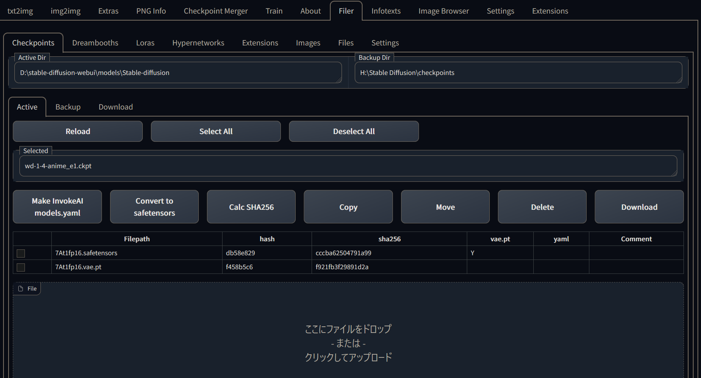

# sd_filer
File Management of Models, Hypernetworks, Extensions, and Images.

- Filer(フィレール)は、フランス語で「紡ぐ」という意味です
  - ただのファイラーです
- 1111の入ったSSDとバックアップのHDDをやりとりするのに便利
- クラウドの揮発ストレージと不揮発ストレージのやりとりにも便利

# 機能概要

- Active-Backup間のCopy/Move/Delete
- ファイルのUpload/Download
- URLからActiveへの外部ファイルのダウンロード
- ckptからsafetensorsへの変換
- ファイルの完全なsha256の計算(.sha256ファイルへの保存)
- InvokeAI用のModels.yamlファイルの作成
- Hypernetworksのstate_dict情報の確認
- 一部ファイルの編集

# At your own risk

- Deleteボタンを押すと選択したファイルが消えます
- 複数のブラウザタブ等を開いて異なる設定で動作させると大変なことが起きます
- 第三者がgradioを操作できる場合、環境を壊したりファイルを盗んだりできます
- その他何があっても作者は責任を負いません

## 細かいバグ

gradioの知識が足りなくてうまく実装できてない

- WindowsではExtensionsのファイル操作でパーミッションエラーが出る(直せません)
- Reloadボタンなどがタイミングによってうまく動作しないことがあります(asyncの影響?)
- ファイル操作をした後、選択したファイルの一覧とダウンロードするファイルの一覧が古いまま画面に残ります
- ファイル操作の結果が画面でなくコンソールに出力されます
- 進捗がわかりにくい(Loading...が出てるか消えたかくらい)
- コードの一部に激しいコピペ部分があります(filer.js)

## UI機能は打ち止め

- gradioでUIを作りこむのは非常に困難だとわかったのでUIはこれ以上凝らない

# 共通

- タブを開いたらまずは Reload ボタンを押そう

# Settings

- Backup Directory に保存先のディレクトリをフルパスで入力してください
  - 最低限、Backup Directory さえ指定すれば動きます
- タブごとに別のディレクトリを指定することもできます
- ディレクトリが存在しない場合、自動的に作成されます

## Extension内のjsonフォルダ

- Settingsの内容が保存されます
- Commentsが保存されます

## Activeタブ

- 1111が認識しているファイルが表示されます

## Backupタブ

- Backup Directory内のファイルが表示されます

## Downloadタブ

- テキストエリアに1行1URLを書いてダウンロードできます
- Colabのセル改造すら省略したい人向け
- 進捗表示が出ないけど待つしかない
- ダウンロードに失敗しても何も言わない

## Reloadボタン

- 一覧を再読み込みします(最初にも押す必要があります)

## Save commentsボタン

- comment, genre, modelなど記入した内容を保存する
- 自動保存に出来るけど破損の可能性もありうるのでボタンにした
- Active / Backup を問わず、ファイル名に対してコメントがつきます
  - 移動してもコメントは有効

## Downloadボタン

処理が重いので、うかつに複数のckptを選択してDownloadしないほうがいい

- 選択したファイルをダウンロードできる一覧を画面下部に表示します
- ファイルの場合
  - このボタンを押した時点でtmpにファイルがコピーされます
- ディレクトリの場合
  - このボタンを押した時点でtmpにzipが作成されます
- 画面下部のdownloadリンクを押すとダウンロード開始

## Upload(画面下部)

- Checkpoints, Hypernetworksではファイルのアップロードを行えます。
- Extensions, Imagesではzipファイルのみアップロードを行えます。
  - zipファイルはファイル名のディレクトリに展開されます。

## Copy / Moveボタン

sha256ファイルは同時に処理されます。

- Copy
  - ファイルは shutil.copy()
  - ディレクトリは shutil.rmtree()
- Move
  - どちらも shutil.move()
- 進捗表示出せるかは未調査だけど期待してない

## Deleteボタン

sha256ファイルは同時に処理されます。

- ファイルは os.remove()
- ディレクトリは shutil.rmtree()

# Checkpoint

- 拡張子ckpt, safetensors, vae.ptに対応

## Make InvokeAI models.yamlボタン

- https://github.com/aka7774/sd_invokeai_models_yaml_maker
- InvokeAI/configs/models.yaml の中身を生成する
- 選択したモデルだけ出力できる
- Backupにあるものも指定できる

## Calc SHA256ボタン

- ファイルのSHA256フルハッシュを計算する
- ファイル名.sha256 ファイルに保存する(二重拡張子になる)
- 頭8桁だけを一覧に表示するが滅多に重複しないはず(するようなら桁を増やす)

## vae.pt列

- 同名の.vae.ptファイルが存在すれば Y を表示

## yaml列

- 同名の.yamlファイルが存在すれば Y を表示

## Genre列

- モデルがどういう風に作られたかのメモ(任意)

## Comment列

- メモ(任意)

## 解説

- 実装はCheckpoint Managerを参考にした
  - https://github.com/rvhfxb/checkpoint_manager
- 1111の「Stable Diffusion checkpoint」ドロップダウンをいじる方法は現状存在しなさそう
  - BackupにMoveすれば当然リストからは消える
- X/Y Plotの「Checkpoint」にはファイル名が有効で、「Selected」をコピペして使える
  - 拡張子無しで動くが、safetensor対応に伴って拡張子はつけることにした
- Copy/Move/Deleteに.vae.ptと.yamlを追随させる機能を検討したい気持ちはある
  - チェックボックスでオンオフとか
  - でもvaeは数が少ないしyamlは容量が小さいのでほっといてもいいかなー

# Hypernetworks

## state列

- state_dictにファイルの詳細情報が格納されているのでそれを表示する
- torch.load()しないといけなくて複数ファイルだと結構時間がかかる
- エラーが出るファイルがあるけど原因は深追いしていない

## model列

- どのモデル用のファイルとして作ったかのメモを想定

## 解説

- ファイルのStepsを保存する統一仕様は存在していなさそう
- ファイル名につけている事もある(state_dictのnameは一緒)
- ファイル名が一緒でstate_dictに入っているnameを変えてる事もある
- state_dictにnameが入っていないケースも想定されている
- 元のモデル情報が入っていることもあるらしいが見つかっていない
- 学習ファイルについては、当面は自己管理を徹底するしか無さそう

# Extensions

- ファイルは表示対象外
- 自分自身(sd_filer Extension)も表示対象外

## Move / Delete

Windows だとダメかも

- PermissionError: [WinError 5] で一部ファイル(.git内のオブジェクト)のアクセスが拒否される
- ディレクトリの内容は中途半端になる
- sd_filer が copy したファイルでもダメ
- かといって管理者権限でgradioを実行しましょうと言う気もないので諦める

# Images

- ディレクトリ単位
- ファイル単位の処理には Image Browser を使いましょう

## 一覧に表示されるディレクトリ

- 既定の6つ
  - opts.outdir_txt2img_samples
  - opts.outdir_img2img_samples
  - opts.outdir_extras_samples
  - opts.outdir_txt2img_grids
  - opts.outdir_img2img_grids
  - opts.outdir_save
- generate_from_jsonの2つ(インストールディレクトリを変更していない場合のみ)
  - json
  - webp
- Image Browser の Others タブで追加したディレクトリ
  - path_recorder.txtに保存されている

## Move / Delete

- ディレクトリ内の全ファイルではなくディレクトリごと処理します
- よって元のディレクトリは無くなります

# Files

- ファイル単位
- 設定ファイルとかログファイルとかをさっさと見たりいじったり

## 一覧に表示されるファイル

- 既定の5つ
  - config.json
  - ui-config.json
  - extensions/stable-diffusion-webui-images-browser/path_recorder.txt
  - extensions/sdweb-merge-block-weighted-gui/csv/history.tsv
  - extensions/sdweb-merge-block-weighted-gui/csv/preset.tsv

## Load

- 画面中段のテキストエリアに読み込む
- 編集してSaveで保存できる

## Download

- 他と同じ
